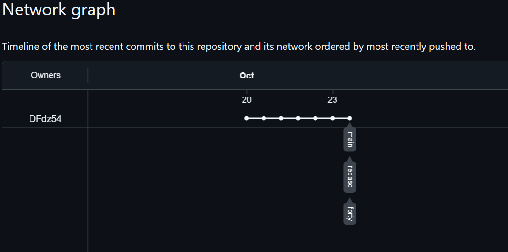

# README.md

### Darío Fernández Márquez


En este repositorio podemos encontrar las carpetas donde irán los archivos ".md" de las tareas:

- Repaso de Linux
- Forty 


URL del repositorio:

```url
https://github.com/DFdz54/TareasDeClase-byDFM.git
```

Captura del gráfico  GitHub 'Insights-Network: Network graph'.



