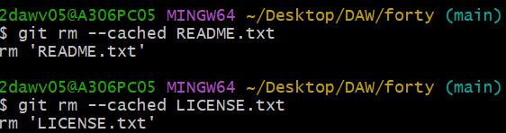
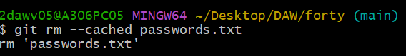
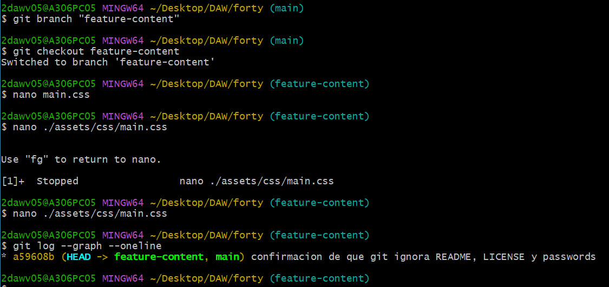
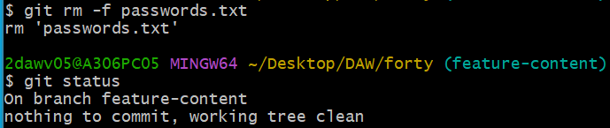
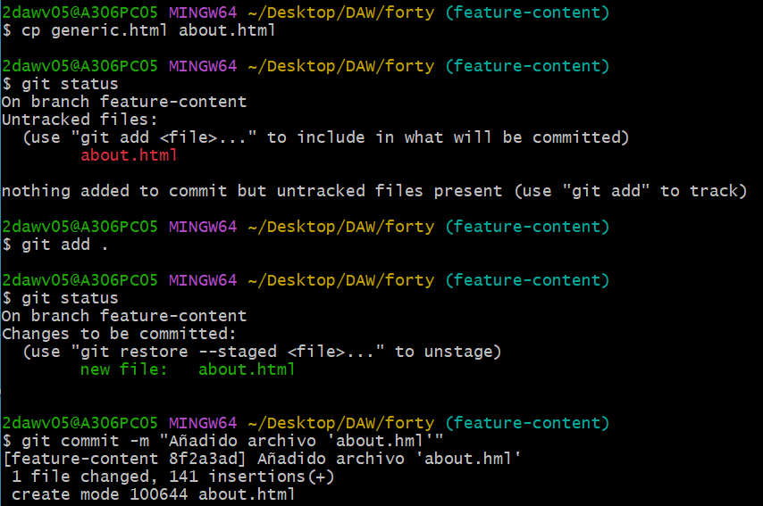

## EJERCICIO GIT-"FORTY"-"LOCAL/REMOTO"

[TOC]

#### TRABAJO LOCAL

Hacer que los ficheros README.txt y LICENSE.txt sean ignorados por el control de versiones

Crear archivo passwords.txt e ignorado en el CDV

Crear rama "feature-content" y ver logs graficamente

Eliminar el password.txt y verificar estatus

Añadir archivo about.html a partir de generic.html

Editar y hacer commit del archivo "generic.html"

