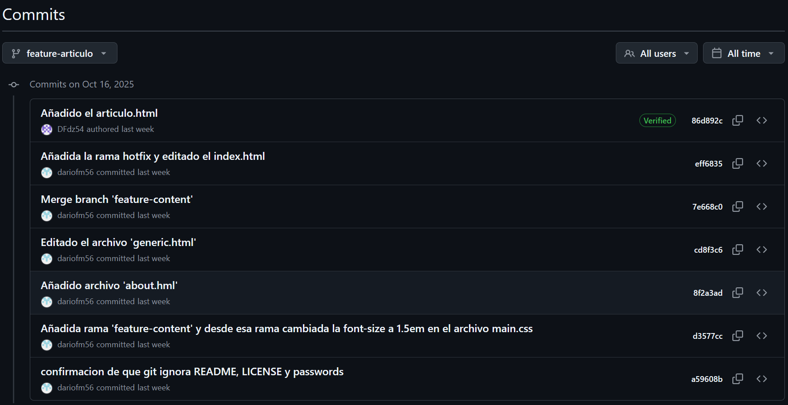
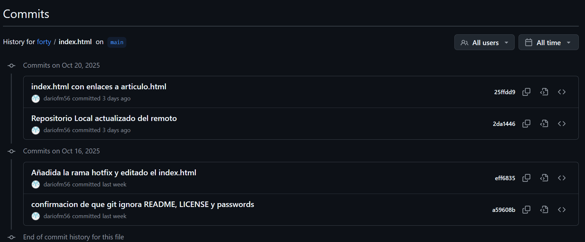

## EJERCICIO GIT-"FORTY"-"LOCAL/REMOTO"

[TOC]

#### TRABAJO LOCAL

1- Hacer que los ficheros README.txt y LICENSE.txt sean ignorados por el control de versiones


```bash
git rm --cached README.txt
git rm --cached LICENSE.txt
```

2- Crear archivo passwords.txt e ignorado en el CDV


```bash
git rm --cached passwords.txt
```

3- Crear rama "feature-content" y ver logs graficamente


```bash
git branch "feature-content"
git checkout feature-content
nano ./assets/css/main.css
git log --graph --oneline
```

4- Eliminar el password.txt y verificar estatus


```bash
git rm -f passwords.txt
git status
```

5- Añadir archivo about.html a partir de generic.html


```bash
cp generic.html about.html
git status
git add .
git status
git commit -m "añadido archivo about.html"
```

6- Editar y hacer commit del archivo "generic.html"

```bash
git add generic.html
git commit -m "Actualiza contenido de generic.html"
git log --oneline --graph --decorate --all
```

7- Modificar el afichero elements.hmlt y comprobar cambios

```bash
git status
git add .
```

8- Mirar las diferencias de elements.html y deshacer cambios

```bash
git diff elements.html
git restore elements.html
git status 
```

9- Mostrar la diferencia entre las dos ramas

```bash
git diff main feature-content
```

10- Fusionar la rama "feature-content" con main y mostrar logs

```bash
git checkout main
git merge feature-content
git log --oneline --graph --decorate --all
```

11- Crear una rama nueva "hotfix" y corregir un error en index.html

```bash
git branch hotfix
git add index.html
git commit -m "Añadido enlace a about.html"
```

12- Fusionar la rama "hotfix" con la rama principal y ver los commits

```bash
git checkout main
git merge hotfix
git log --oneline --graph --decorate --all
```

13- Mostrar el historial de cambios limitado a los ultimos 3 commits

```bash
git log -3 --oneline
```

14- Etiqueta el commit actual como "v1.0" y mostrar las etiquetas

```bash
git tag v1.0
git tag
```

#### TRABAJO REMOTO

1- Subir al remoto los ficheros locales

```bash
git push -u origin main
```

2- Crear la rama "feature-head", cambiar el titulo a index.html, borrar comentarios y confirmar y subir los cambios

```bash
git checkout -b feature-head
git add index.html
git commit -m "Actualiza sección head en index.html"
git push -u origin feature-head
```

3- En remoto crear la rama "feature-articulo", duplicar "generic", nombrarla "articulo.html", confirmar cambios, 

realizar un commit y mostrar los commits del repositorio



4- Actualizar repositorio Local con el Remoto, fusionar en main las dos ramas "feature",crear la etiqueta "v2.0",

mostrar los logs, commits, etiquetas y ramas actuales, en local y remoto.

```bash
git fetch origin
git checkout main
git merge origin/feature-head
git merge origin/feature-articulo
git tag v2.0
git log --oneline --graph --decorate --all
git tag
git branch -a
```

5- En Local crear una rama "nueva" y cambiar los enlaces de la pagina index.html y confirmar los cambios

```bash
git branch nueva
git add index.html
git commit -m "Actualiza enlaces en index.html hacia articulo.html"

```

6- Mostrar los logs para que se vean las ramas del Local

```bash
git log --oneline --graph --decorate --all
```

7- Incorporar los cambios de la rama "nueva" a la rama principal

```bash
git checkout main
git merge nueva
```

8- Subir los cambios al Remoto borrando la rama "nueva" y comprobar desde el Local las ramas del Remoto

```bash
git push origin main
git branch -d nueva
git push origin --delete nueva
git branch -r
```

9- Mostrar en local los cambios en el archivo index.html entre la version actual y la anterior

```bash
git diff HEAD~1 HEAD -- index.html
```

10- En el repositorio de GitHub,mostrar la opcion "History" en el archivo index.html


